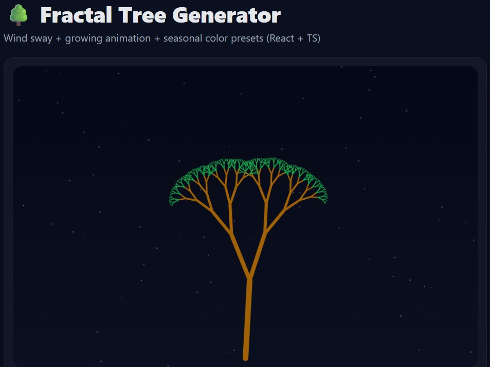
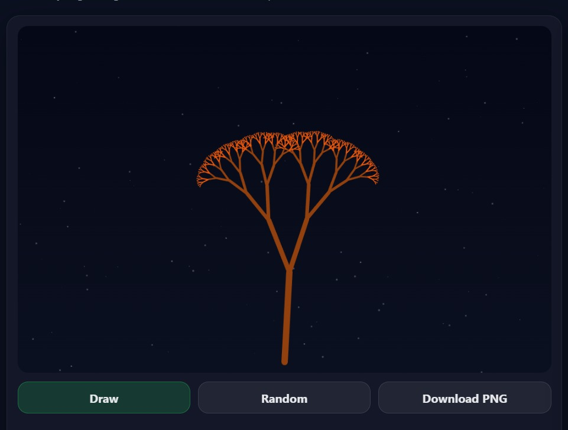
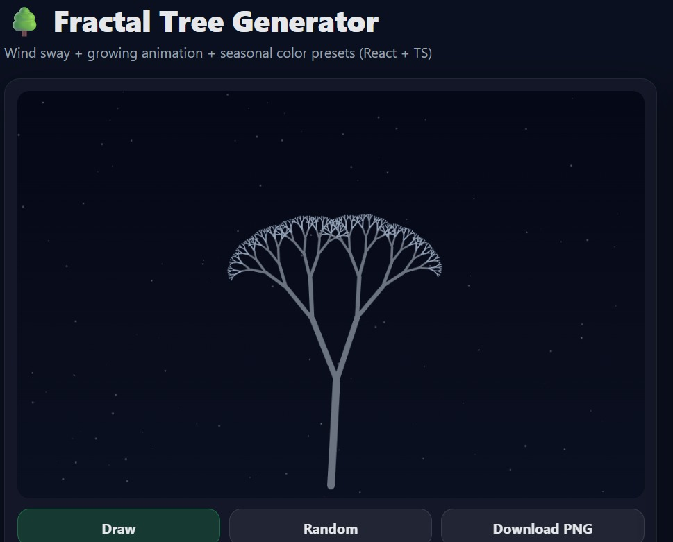
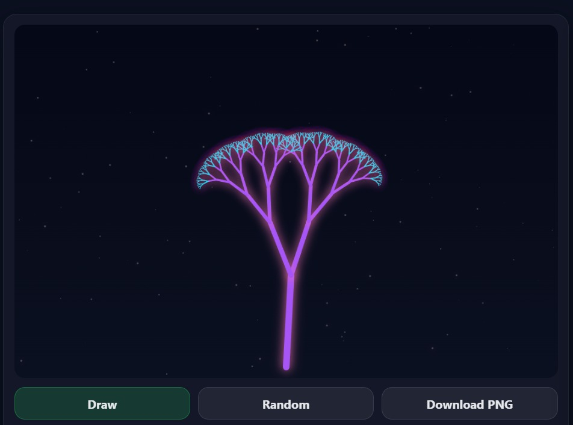

# 🌳 Fractal Tree Generator (React + TypeScript)

An interactive **Fractal Tree Generator** built using **React + TypeScript + HTML Canvas**, featuring **recursive tree generation**, **wind sway animation**, **growing draw animation**, and **seasonal color presets**.

🔗 Live Demo: <YOUR_DEPLOYED_LINK_HERE>  
📦 GitHub Repo: <YOUR_GITHUB_REPO_LINK_HERE>

---

## ✨ Features

✅ **Recursive Fractal Tree Generation** (Depth-based branching)  
🌬️ **Wind Animation** (branches sway naturally)  
🌱 **Growing Animation** (tree draws step-by-step)  
🎨 **Color Presets**: Spring / Autumn / Winter / Neon  
🎛️ **Real-time Controls** (depth, angle, shrink, thickness, randomness)  
📥 **Download as PNG** (export your tree)  
📱 **Responsive UI** (works on laptop + mobile)

---

## 🧠 How it Works (Core Logic)

This project uses **recursion** to draw a tree where each branch splits into two smaller branches:

- Each recursive call reduces:
  - branch length (shrink factor)
  - thickness
  - depth (stopping condition)

Canvas rendering makes the visualization fast and smooth.

---

## 🛠️ Tech Stack

- **React**
- **TypeScript**
- **HTML Canvas**
- **Vite**
- **CSS**

---

## 📸 Snapshots

> Add screenshots here after you run the project.

### 🌿 Spring Preset (Growing Animation)


### 🍂 Autumn Preset (Wind Sway)


### ❄️ Winter Preset (Minimal + Clean)


### 💜 Neon Preset (Portfolio Mode)


---

## 🚀 Getting Started (Run Locally)

Clone the repo:
```bash
git clone <YOUR_GITHUB_REPO_LINK_HERE>
cd fractal-tree
